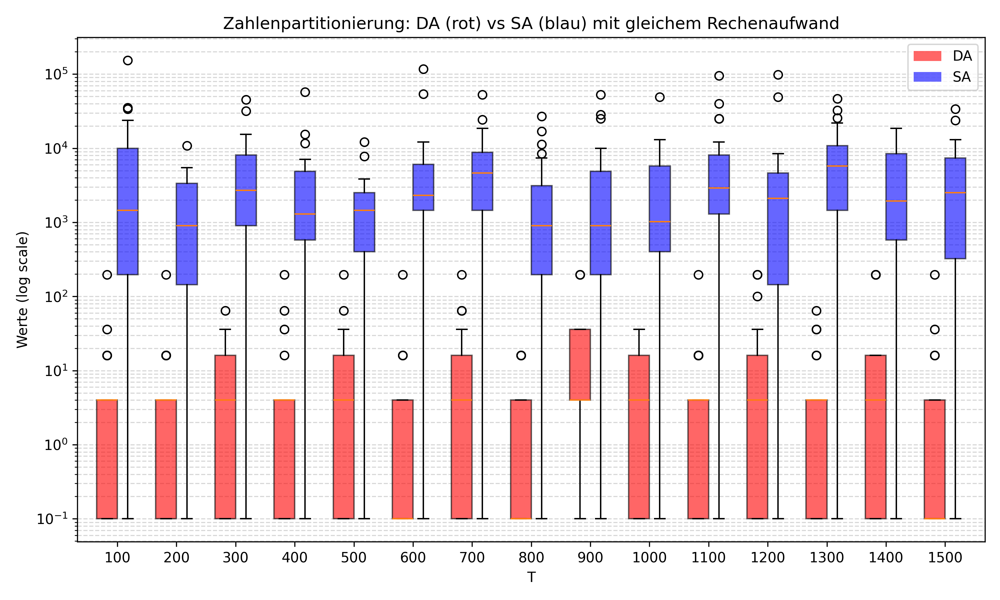
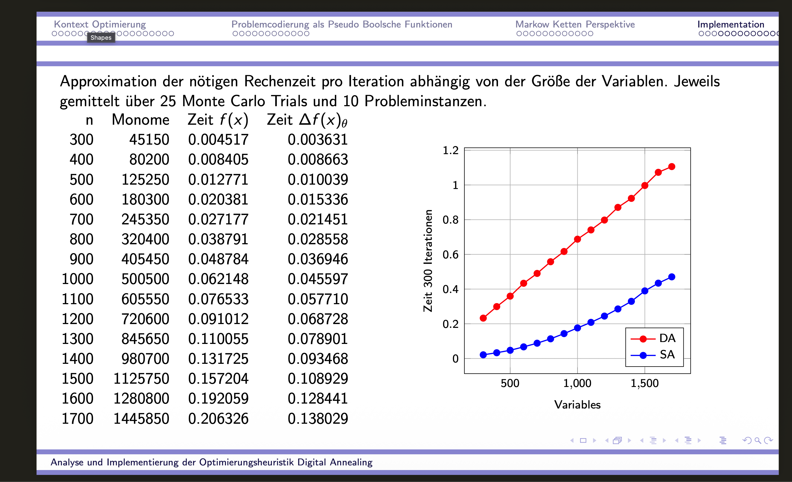

# AnnealingCopApproximator

> Implementations of Simulated Annealing, Digital Annealing, and related algorithms for solving combinatorial optimization problems encoded as Pseudo-Boolean Functions.

This repository contains the practical implementation component of the Master's thesis **"Analyse und Implementierung der Optimierungsheuristik Digital Annealing"** (OTH Regensburg, 2025). It benchmarks classical and quantum-inspired annealing heuristics on a range of NP-hard combinatorial optimization problems.

---

## Table of Contents

- [Overview](#overview)
- [Mathematical Framework](#mathematical-framework)
- [Algorithms](#algorithms)
- [Supported Problems](#supported-problems)
- [Repository Structure](#repository-structure)
- [Installation](#installation)
- [Usage](#usage)
- [Results](#results)
- [Ongoing Research](#ongoing-research)
- [Scalability & Hardware Context](#scalability--hardware-context)
- [References](#references)

---

## Overview

All optimization problems in this project are encoded as **Pseudo-Boolean Functions (PBFs)**:

$$P : \{ 0,1\} ^n \to \mathbb{R}, \quad P(x) = \sum_{S \subseteq \{1,\ldots,n\}} a_S \prod_{k \in S} x_k$$

PBFs are represented in Python as dictionaries mapping monomial tuples to real coefficients:

```python
pbf = {
    (0,):    -1.5,   # linear term for variable 0
    (1,):    -2.0,   # linear term for variable 1
    (0, 1):   1.0,   # quadratic coupling between 0 and 1
    (0, 1, 2): 0.5,  # cubic term (PUBO)
}
```

This general representation covers both **QUBO** (degree ≤ 2) and **PUBO** (higher degree, e.g. 3-SAT). The goal in all cases is to find the binary assignment $x^* \in \{0,1\}^n$ that minimizes $P(x)$.

---

## Mathematical Framework

### Simulated Annealing (SA)

SA defines a Markov chain on $\{0,1\}^n$ via single bit-flip proposals (Metropolis-Hastings). The acceptance probability for a proposed flip of bit $k$ is:

$$\alpha(\Delta E) = \min\left(1,\, e^{-\Delta E / T}\right), \quad \Delta E = P(\theta_k(x)) - P(x)$$

Under a logarithmic cooling schedule $T(t) = c / \log(1+t)$, SA converges to the **Gibbs-Boltzmann distribution**:

$$\pi^G(x) = \frac{e^{-P(x)/T}}{Z}, \quad Z = \sum_{x'} e^{-P(x')/T}$$

### Digital Annealing (DA)

DA evaluates all $n$ possible single bit-flips simultaneously at each step. The transition probability is:

$$P^{DA}(x, \theta_k(x)) = \sum_{\substack{S \subseteq [n] : \\ k \in S}} \frac{1}{|S|} \prod_{i \in S} e^{-(\Delta\theta_i(x)) ^+ / T} \prod_{i \notin S} \left(1 - e^{-(\Delta\theta_i(x)) ^+ / T}\right)$$

DA does **not** satisfy detailed balance, which means its stationary distribution $\pi^{DA}$ differs from $\pi^G$. The implementation additionally uses a **dynamic energy offset**: if no bit-flip is accepted in a given step, an energy offset $\epsilon$ is added to help escape local minima.

### Efficient Delta-Energy Computation

The implementation works directly on the PBF dictionary representation. After a bit-flip at position $k$, the change in energy is:

$$\Delta E_k = P(\theta_k(x)) - P(x) = \sum_{S \ni k} a_S \cdot (1 - 2x_k) \prod_{j \in S \setminus \{k\}} x_j$$

Only monomials containing variable $k$ are evaluated, giving $O(|\text{support}(k)|)$ per flip. Crucially, this implementation uses an **incremental update method**: after accepting a flip of bit $k$, the delta-energy vector for all other bits is updated locally rather than recomputed from scratch (See Masterarbeitspräsentation.pdf p.53-55). This yields a significant constant-factor speedup and is one of the core efficiency contributions of this codebase. In a suitable GPU orchestration, this approach is expected to be highly competitive.

---

## Algorithms

| Algorithm | Description |
|-----------|-------------|
| **Simulated Annealing (SA)** | Metropolis-Hastings with single bit-flip proposals. Converges to $\pi^G$. |
| **Digital Annealing (DA)** | Main benchmark algorithm of DA with the update method (see Masterarbeitspräsentation.pdf); energy offset escape mechanism. |
| **DA (parallel)** | DA with Python `multiprocessing` for parallel flip evaluation. |
| **SCA Annealing** | Stochastic Cellular Automata variant: simultaneous update of all bits per step. |
| **Tensor Annealing** | TensorFlow-based DA with GPU acceleration; QUBO delta-energy via $\Delta E_i = -2x_i(Q_i \cdot x)$. |

### Cooling Schedules

| Schedule | Formula |
|----------|---------|
| Logarithmic | $T(t) = c \,/\, \log(1+t)$ |
| Exponential | $T(t) = T_0 \cdot \alpha^t$ |
| Linear | $T(t) = T_0 - r \cdot t$ |
| Adaptive | Temperature adjusted based on acceptance rate |

---

## Supported Problems

| Problem | Encoding | Script |
|---------|----------|--------|
| **3-SAT** | Clause $(a \vee b \vee c)$ → PBF penalty $(1-a)(1-b)(1-c)$; SATLIB benchmarks | `Skript_Solve_3SAT.py` |
| **Traveling Salesman (TSP)** | QUBO via binary position matrix $x_{ij}$ with constraint penalties | `Skript_Solve_Traveling_Salesman.py` |
| **Number Partitioning (NPP)** | QUBO formulation | `Skript_Solve_NumberPartitioning.py` |
| **Graph Partitioning** | Divide-and-conquer clustering for large TSP instances | `Skript_Solve_GraphPartitioning.py` |
| **2D Ising Model** | Direct QUBO encoding of spin interactions | `Skript_IsingModel_Simulator.py` |
| **Binary / Integer Programming** | General BIP/IP encoding as PBF | `Skript_Solve_Integer_Programm.py` |
| **Random PBF** | Randomly generated PBF landscapes for benchmarking | `Skript_Solve_Random_Generated_pbf.py` |
| **Database Join Ordering** | QUBO via cardinality/selectivity constraints; D-Wave, IBM, Fujitsu compatible | `Skript_Join_Ordering.py` |
| **Generalized Transportation** | QUBO formulation | `Skript_Solve_GTP.py` |

---

## Repository Structure

```
AnnealingCopApproximator/
│
├── Code/                          # All Python source code
│   │
│   ├── Core algorithms
│   │   ├── Funcs_Annealers.py         # SA, DA, DA_parallel, SCA annealing loops
│   │   ├── Funcs_Annealing2.py        # Delta-E, cooling schedules, run utilities
│   │   └── TensorAnnealing.py         # TensorFlow-based GPU-accelerated SA
│   │
│   ├── PBF / QUBO generators
│   │   ├── Funcs_pbfGenerators.py     # 3-SAT, Ising, NPP, clustering → PBF
│   │   ├── QUBOGenerator.py           # Join ordering → QUBO (IBM/D-Wave/Fujitsu)
│   │   └── ProblemGenerator.py        # Join ordering data loading & serialization
│   │
│   ├── Problem-specific solvers
│   │   ├── Funcs_TSP.py               # TSP encoding, 2-opt, greedy, visualization
│   │   ├── Funcs_lkh.py               # Lin-Kernighan-Helsgaun heuristic wrapper
│   │   └── Funcs_Optimizers.py        # Monte Carlo orchestration, graph partitioning
│   │
│   ├── Experiment scripts
│   │   ├── Skript_Solve_3SAT.py
│   │   ├── Skript_Solve_Traveling_Salesman.py
│   │   ├── Skript_Solve_NumberPartitioning.py
│   │   ├── Skript_Solve_GraphPartitioning.py
│   │   ├── Skript_Solve_Integer_Programm.py
│   │   ├── Skript_Solve_Random_Generated_pbf.py
│   │   ├── Skript_IsingModel_Simulator.py
│   │   ├── Skript_Solve_GTP.py
│   │   └── Skript_Join_Ordering.py
│   │
│   └── Visualization & export
│       ├── DataExport.py              # CSV/JSON/gzip export, MILP cost normalization
│       ├── MakeBoxplot.py             # Join ordering result boxplots (Plotly)
│       └── Visualize_Evaluation.py    # Runtime vs. objective scatter plots
│
├── 3SAT_DATA/                     # SATLIB benchmark instances (.cnf)
├── TSP_data/                      # Standard TSP benchmark instances
├─��� Runs/                          # Experimental outputs (Nov 2025 evaluations)
│   ├── Evaluation_2025-11-02/
│   ├── Evaluation_2025-11-03/
│   ├── Evaluation_2025-11-20/
│   └── Vergleich_SAundDA/         # Direct SA vs. DA comparison data
│
├── Boxplot.py                     # DA vs. SA boxplot (matplotlib)
├── Masterarbeitspräsentation.pdf  # Master's thesis presentation (primary documentation)
├── boxplot_da_sa.png
├── grouped_boxplot_da_sa.png
└── grouped_boxplot_da_sa_log.png
```

---

## Installation

Install dependencies manually:

```bash
pip install numpy pandas matplotlib plotly sympy p_tqdm Pillow
```

For GPU-accelerated tensor annealing:
```bash
pip install tensorflow
```

For the Lin-Kernighan TSP heuristic:
```bash
pip install lk_heuristic
```

For join ordering QUBO generation (optional, platform-specific):
```bash
pip install docplex dimod qiskit-optimization
```

> **Note:** Some experiment scripts contain hardcoded file paths. Adjust these to your local setup before running.

---

## Usage

All scripts are run from within the `Code/` directory, or from the repository root for root-level scripts.

### Run an annealing experiment

```bash
# From Code/
python Skript_Solve_3SAT.py
python Skript_Solve_NumberPartitioning.py
python Skript_Solve_Traveling_Salesman.py
python Skript_Solve_Integer_Programm.py
python Skript_Solve_Random_Generated_pbf.py
python Skript_IsingModel_Simulator.py
```

### Core API

The main entry point for programmatic use is `pbf_min_solver` in `Funcs_Optimizers.py`:

```python
from Funcs_Optimizers import pbf_min_solver

# Define a QUBO as a PBF dictionary
pbf = {(0,): -1.0, (1,): -1.0, (0, 1): 2.0}
pbf_var_dict = {0: "x0", 1: "x1"}

result = pbf_min_solver(
    pbf,
    pbf_var_dict,
    type_alg="digitalAnnealing",   # or "simulatedAnnealing", "scaAnnealing"
    steps=10000,
    num_MC=20,                      # number of independent Monte Carlo trials
    cooling_param=["logarithmic", 100, 0]
)
```

### Generate plots

```bash
# From repository root
python Boxplot.py
```

---

## Results

Benchmark experiments comparing SA and DA on the Number Partitioning Problem (300–1700 variables):





Key observations:
- DA is approximately **3–5× slower per step** than SA due to the overhead of evaluating all $n$ bit-flips simultaneously.
- Despite the per-step overhead, DA shows competitive or superior solution quality on the tested instances.
- Ongoing experiments explore the trade-off between solution quality and runtime across different problem types and sizes.

---

## Ongoing Research

This repository is also a testbed for ongoing, unpublished theoretical and applied research.

**Stationary distribution analysis.** DA does not satisfy detailed balance, so its stationary distribution $\pi^{DA}$ is not the Gibbs distribution. Work is underway to analytically characterize $\pi^{DA}$ for structured PBF landscapes and to derive practical statements about the convergence behaviour of DA relative to SA. The goal is to understand when and why DA concentrates probability mass differently than SA at equilibrium — and what that implies for its performance as an optimizer.

**Applications in AI.** A separate line of ongoing work investigates potential applications of Digital Annealing in the context of AI systems. Experiments are currently in progress and results are not yet published.

---

## Scalability & Hardware Context

### This Implementation

The implementation works directly on the **PBF dictionary** — no dense matrix is required. After a bit-flip at position $k$, only monomials containing $k$ are re-evaluated, and the delta-energy vector for all other variables is updated **incrementally** rather than recomputed from scratch. For sparse problems (e.g. 3-SAT, graph-structured QUBOs), this scales significantly better than dense matrix approaches and keeps both memory footprint and arithmetic work close to the theoretical minimum.

The TensorFlow-based path (`TensorAnnealing.py`) maps the dense QUBO case — equivalent to a matrix-vector product $Qx$ at each step — directly onto GPU tensor cores, achieving near-optimal GPU utilisation. In a suitable GPU orchestration that pipelines the incremental update method, the implementation is expected to be highly competitive with general-purpose software solvers.

### Why Fujitsu's Digital Annealer is Faster

Despite this, the implementation cannot match Fujitsu's Digital Annealer in raw speed. The reason is architectural:

Fujitsu's DA is implemented in **dedicated CMOS hardware** (ASIC / FPGA), not on a general-purpose GPU or CPU. The key hardware advantages are:

- **True hardware parallelism.** A GPU executes operations in warps with shared memory bandwidth constraints. Fujitsu's chip evaluates all $n$ bit-flip candidates simultaneously in a single clock cycle with dedicated combinatorial circuits — no memory bottleneck, no scheduler overhead.
- **On-chip storage of the full $Q$ matrix.** The coupling matrix sits in on-chip SRAM directly adjacent to the processing units, eliminating the global memory bandwidth bottleneck that dominates GPU performance at large $n$.
- **Nanosecond-scale step times.** Each annealing step on the Fujitsu DA3 takes on the order of nanoseconds. A GPU-based implementation is bound by kernel launch overhead and memory latency, making it orders of magnitude slower per step at large $n$.
- **Hardwired acceptance logic.** The exponential acceptance probability is computed in dedicated analogue or digital circuits, not in a software loop.

In short: this repository demonstrates that the DA algorithm can be implemented efficiently in software and scales well for sparse problems, but the fundamental speed advantage of Fujitsu's hardware comes from eliminating the software stack entirely and embedding the algorithm directly into silicon.

---

## References

### Papers

- Fukushima-Kimura, B.H., Kawamoto, N., Noda, E., Saburi, K., Tasaki, H. (2023). *Mathematical aspects of the digital annealer's simulated annealing algorithm.* Journal of Statistical Physics. [DOI: 10.1007/s10955-023-03179-3](https://link.springer.com/article/10.1007/s10955-023-03179-3) — [arXiv:2303.08392](https://arxiv.org/abs/2303.08392)
- Kirkpatrick, S., Gelatt, C.D., Vecchi, M.P. (1983). *Optimization by Simulated Annealing.* Science.
- Hajek, B. (1988). *Cooling Schedules for Optimal Annealing.* Mathematics of Operations Research.

### Benchmark Data

- SATLIB Benchmark Suite (3-SAT instances): https://www.cs.ubc.ca/~hoos/SATLIB/benchm.html
- Dr. Manuel Schönberger, *Join Ordering via Quantum-Inspired Optimization.* VLDB 2024. https://github.com/lfd/vldb24

### Libraries & Tools Used

- `lk_heuristic` — Lin-Kernighan-Helsgaun TSP heuristic: https://github.com/pfayle/lk_heuristic
- `p_tqdm` — Parallel tqdm progress bars: https://github.com/swansonk14/p_tqdm
- `dimod` — D-Wave binary quadratic model library: https://github.com/dwavesystems/dimod
- `docplex` — IBM Decision Optimization CPLEX Modeling: https://github.com/IBMDecisionOptimization/docplex-doc
