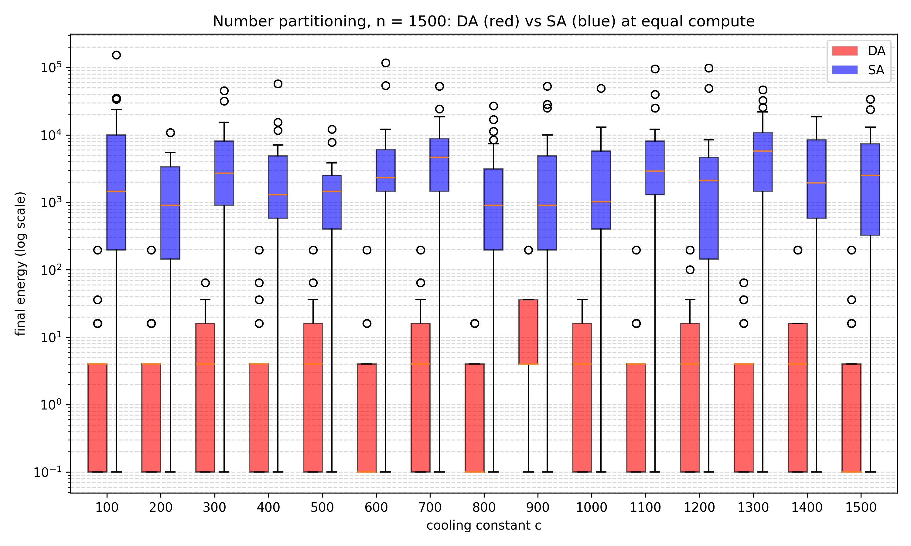
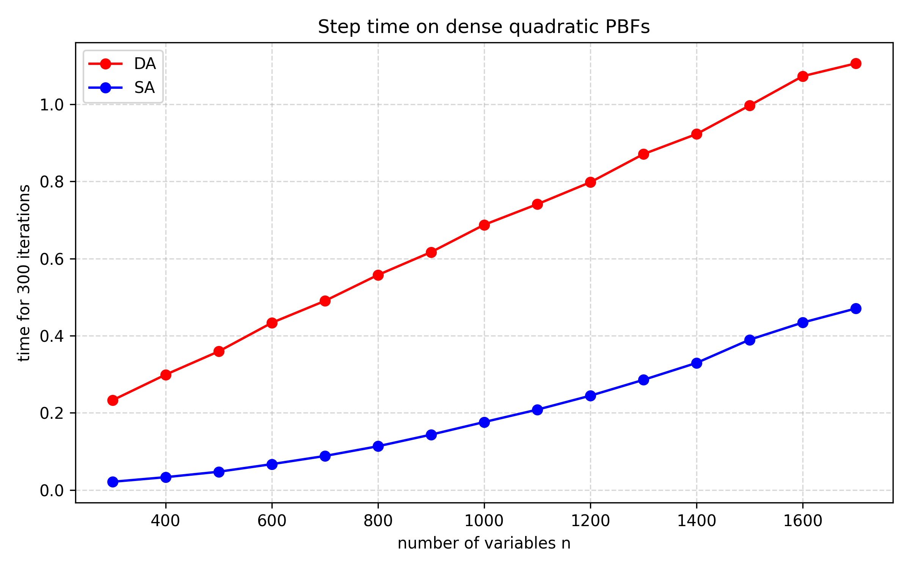

# Performance and hardware context

Measured solution quality and step time of DA against SA, how this
implementation scales, and how it relates to Fujitsu's Digital Annealer.

- [Results](#results)
- [Regenerating the figures](#regenerating-the-figures)
- [This implementation](#this-implementation)
- [Fujitsu's Digital Annealer](#fujitsus-digital-annealer)

## Results

**Solution quality at equal compute.** One number-partitioning instance with
$n = 1500$ numbers, cooling schedule `["logarithmic", c, 0]` for
$c = 100, \dots, 1500$ (x-axis), DA with 100 steps against SA with
400,
40 runs per box (`Code/Skript_Solve_NumberPartitioning.py`, data in
`Code/Data.csv`).
Final energy on a log scale; energy 0 is drawn as 0.1, and each box also holds
two
padding values of 0.1 from an empty column in `Data.csv`.



**Time per step.** Time for 300 iterations against the number of variables
$n = 300, \dots, 1700$ on dense quadratic PBFs with $n(n+1)/2$ monomials; raw
data in `Aggregiert.csv`. Drawn by `Timingplot.py`.



Key observations:
- A DA step costs **10.9×** an SA step at $n = 300$ and **2.35×** at $n = 1700$
  (`Aggregiert.csv`): all $n$ acceptance tests per step plus the incremental
  update of the delta vector, against a single evaluation for SA. The overhead
  shrinks as $n$ grows.
- Despite the per-step overhead, DA's median final energy is two to three orders
  of magnitude below SA's at equal compute (median ratio 225–1,522 for the
  cooling constants where DA's median is non-zero).
- [findings.md](findings.md#3-where-da-is-actually-faster-the-speed-up-ramp)
  explains part of this: at the temperatures where annealing does its work, DA's
  Markov chain relaxes up to $n$ times faster than SA's.

## Regenerating the figures

```bash
python Boxplot.py      # solution-quality boxplot from Code/Data.csv
python Timingplot.py   # step-time figure from Aggregiert.csv
```

Both scripts resolve their paths relative to their own location, so they run
from any working directory and write straight into `docs/img/`.

## This implementation

The implementation works directly on the **PBF dictionary** — no dense matrix is
required — and updates the delta-energy vector incrementally
([framework.md](framework.md#incremental-delta-energy-update)). For sparse
problems (3-SAT, graph-structured QUBOs) this scales far better than dense
matrix approaches and keeps memory and arithmetic close to the theoretical
minimum.

For dense QUBOs there is a TensorFlow variant, see
[configuration.md](configuration.md#algorithms).

## Fujitsu's Digital Annealer

The algorithm implemented here is the one Fujitsu ships: parallel trial of all
bit-flips per step, uniform choice among the accepted ones, and the
energy-offset escape mechanism ([Aramon et al. 2019](references.md#papers)). How
that algorithm is *executed* has changed over the product's generations, and
with it the meaning of a comparison with this repository:

- **Dedicated CMOS hardware, up to 8,192 bits.** The first generation (2018) was
  a 1,024-bit chip; the second-generation Digital Annealer Unit (late 2018) an
  8,192-bit fully connected CMOS ASIC that evaluates all flips in parallel with
  the coupling matrix on-chip. That is where the per-step speed advantage over
  any software implementation came from.
- **Beyond the chip: software on linked servers.** The problem sizes advertised
  since — 100,000 variables in the fourth generation (2022), and a demonstrated
  1,014,000-bit scheduling problem in 2020 — are not reached by a larger chip.
  Fujitsu's own announcement describes "a technology to solve large-scale
  problems with multiple linked servers while ensuring consistency in overall
  solutions", and the service documentation notes that problem scaling and
  energy recalculation run on CPUs.

For the large-scale service the comparison is therefore algorithmic, not
architectural: the same update rule and the same escape mechanism, hence
comparable solution quality per step. What Fujitsu adds is an engineered
software stack around it (vectorised evaluation, replica exchange, automatic
parameter selection, distribution across servers); what this repository adds is
the incremental delta-energy update for sparse PBFs. We have not benchmarked
head-to-head against the service — the claim is algorithmic equivalence, not
measured parity.

Sources for the generations and problem sizes:
[references.md](references.md#fujitsu-digital-annealer).
